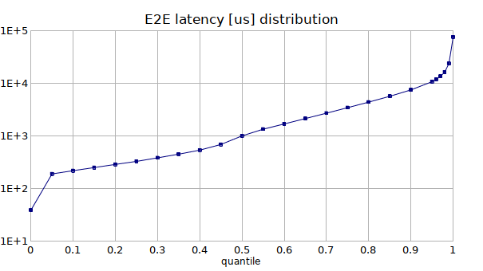
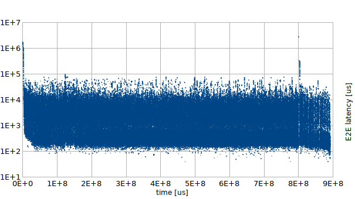

# End-to-end latency generator

The tool consuming the [Mongoose](https://github.com/emc-mongoose/mongoose-base)'s 
[operations trace output data](https://github.com/emc-mongoose/mongoose-base/tree/master/doc/interfaces/output#232-files) 
and producing the raw *end-to-end* latency data. The *end-to-end* latency is a time span between the `CREATE` and `READ` 
operations executed for the same *item*. More precisely:
> t = t3 + t4 - t1 - t2

where
* `t` is a calculated end-to-end latency
* `t1` is a `CREATE` request start time
* `t2` is a `CREATE` request duration
* `t3` is a `READ` request start time
* `t4` is a `READ` response latency

## Approach

### Input Data

Some storages support the *subscription* for the messages which should be read back immediately after been written. The 
*end-to-end* latency may be measured using Mongoose's 
[Pipeline Load](https://github.com/emc-mongoose/mongoose-load-step-pipeline) extension. To do this, it's necessary to 
produce the raw 
[operations trace data](https://github.com/emc-mongoose/mongoose-base/tree/master/doc/interfaces/output#232-files).

Example Mongoose scenario to test [Pravega](https://github.com/pravega/pravega):
```javascript
var sharedConfig = {
	"storage": {
		"driver": {
			"type": "pravega"
		}
	},
	"output": {
		"metrics": {
			"trace": {
				"persist": true
			}
		}
	}
}

var readConfig = {
	"load": {
		"op": {
			"type": "read"
		}
	},
	"storage": {
		"driver": {
			"event": {
				"timeoutMillis": 2000000000
			}
		}
	}
}

PipelineLoad
	.config(sharedConfig)
	.append({})
	.append(readConfig)
	.run()
```

This scenario may be launched using the following example command:
```bash
java -jar mongoose-base/build/libs/mongoose-4.2.10.jar \
    --storage-driver-type=pravega \
    --storage-namespace=scope1 \
    --storage-net-node-port=9090 \
    --item-output-path=stream1 \
    --run-scenario=src/test/robot/api/storage/data/e2e_latency.js \
    --load-step-id=e2e_latency_test \
    --item-data-size=10KB \
    --storage-driver-limit-concurrency=10 \
    --load-op-limit-count=100000
```

### Output Format

The tool writes the CSV records to the standard output. Each CSV record has has the following columns:
1. Item path (may be considered as a file/object/message/event identifier)
2. Item writing start time offset in microseconds
3. The calculated end-to-end latency

Example:
```csv
...
stream1/bws8pvw9sghq,1556724379276017,1538916
stream1/5ua3l2kietxd,1556724379276237,1418718
stream1/81t6larvcuhw,1556724379276402,1420782
stream1/7i2e1sfbiy0o,1556724379280238,1421182
stream1/gotspifzf14h,1556724379281785,1421532
stream1/rufanzc5zugn,1556724379285645,1425138
stream1/89iv0a4lwj6v,1556724379286654,1422829
stream1/8v5z8cc9dgd6,1556724379287174,1419372
stream1/ryfpwg6nxwb8,1556724379287413,1417090
stream1/gho8ejqhyxe2,1556724379287603,1354413
stream1/wykisi3nc223,1556724379292403,1352918
...
```

## Usage

### Build
```bash
go build main/e2elatgen.go
```

### Run

Example:
```bash
./e2elatgen ~/.mongoose/4.2.10/log/e2e_latency_test/op.trace.csv > e2e_latency_test.csv
```

### Results Analysis

The resulting file may be used to analyze the *end-to-end latency* distribution or temporal profile. The charts below 
were produced using the spreadsheet processor for the resulting CSV data:




Note the high latency yield during the first 2 seconds. This is supposed to be the HotSpot intervention.