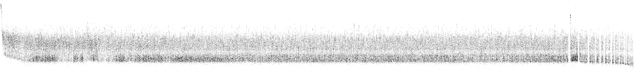

# End-to-end latency generator

The tool consuming the [Mongoose](https://github.com/emc-mongoose/mongoose-base)'s 
[operations trace output data](https://github.com/emc-mongoose/mongoose-base/tree/master/doc/interfaces/output#232-files) 
and producing the raw *end-to-end* latency data. The *end-to-end* latency is a time span between the `CREATE` and `READ` 
operations executed for the same *item*. More precisely:
> t = t3 + t4 - t1 - t2

where
* `t` is a calculated end-to-end latency
* `t1` is a `CREATE` request start time
* `t2` is a `CREATE` request duration
* `t3` is a `READ` request start time
* `t4` is a `READ` response latency

## Approach

### Input

Some storages support the *subscription* for the messages which should be read back immediately after been written. The 
*end-to-end* latency may be measured using Mongoose's 
[Pipeline Load](https://github.com/emc-mongoose/mongoose-load-step-pipeline) extension. To do this, it's necessary to 
produce the raw 
[operations trace data](https://github.com/emc-mongoose/mongoose-base/tree/master/doc/interfaces/output#232-files).

Example Mongoose scenario to test [Pravega](https://github.com/pravega/pravega):
```javascript
var sharedConfig = {
	"storage": {
		"driver": {
			"type": "pravega"
		}
	},
	"output": {
		"metrics": {
			"trace": {
				"persist": true
			}
		}
	}
}

var readConfig = {
	"load": {
		"op": {
			"type": "read"
		}
	},
	"storage": {
		"driver": {
			"event": {
				"timeoutMillis": 2000000000
			}
		}
	}
}

PipelineLoad
	.config(sharedConfig)
	.append({})
	.append(readConfig)
	.run()
```

This scenario may be launched using the following example command:
```bash
java -jar mongoose-base/build/libs/mongoose-4.2.10.jar \
    --storage-driver-type=pravega \
    --storage-namespace=scope1 \
    --storage-net-node-port=9090 \
    --item-output-path=stream1 \
    --run-scenario=src/test/robot/api/storage/data/e2e_latency.js \
    --load-step-id=e2e_latency_test \
    --item-data-size=10KB \
    --load-op-limit-count=100000
```

### Output

#### Standard Output

The tool writes the CSV records to the standard output. Each CSV record has has the following columns:
1. Item path (may be considered as a file/object/message/event identifier)
2. Item writing start time offset in microseconds (relative, starting from 0)
3. The calculated end-to-end latency

Example:
```csv
...
stream1/83t5yxfi12e0,41829867,2751
stream1/a3obpqb01qh6,41835798,229
stream1/aydlzqu14n22,41838473,2999
stream1/5fgdcurymj0q,41841918,805
stream1/wv1q53bs8l61,41843734,1601
stream1/lblm3ytmeyu9,41854278,10644
stream1/36n30r5pa3de,41855355,10879
stream1/pykghts2izmn,41867068,3371
stream1/wcmsurgrpht5,41876439,411
stream1/zhvwrprmontl,41880093,463
stream1/loxvodkyijpn,41884926,2371
stream1/7aeq3w3oo7qy,41886162,3798
stream1/fwexsn3qwa4u,41890030,8396
stream1/6bchppau0mh6,41891615,7530
...
```

#### Heatmap Output

In addition to the standard output, the tool also outputs the `heatmap.png` file containing the produced end-to-end latency heatmap chart.

1. Y axis is logarithmic between the detected latency value min and max. By default it's height is 100 px and corresponding 100 rows.
2. X axis is linear. By default it's width is the count of pixels equal max timestamp minus min.

Raw chart example:


In this chart above, the min latency value is 39 &mu;s, max is 2,814,390 &mu;s. So the ratio between max and min is ~ 72164. This range is divided by the 100 pixel rows each containing the corresponding range with the scale factor of  ~ 1.1183640462987132. The sequence length is 893 seconds (893 pixels).

## Usage

### Build
```bash
go build main/e2elatgen.go
```

### Run

Example:
```bash
./e2elatgen ~/.mongoose/4.2.10/log/e2e_latency_test/op.trace.csv > e2e_latency_test.csv
```
